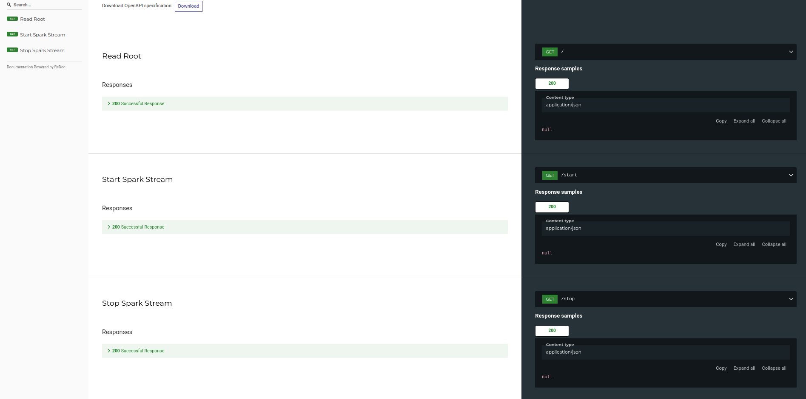

# API for SparkStream Package

## Documentation


Its used to access the <a href="https://github.com/HassanRady/SparkStream">SparkStream Package</a> which is used to process streaming data from a kafka topic into cassandra and redis.

Start Spark Stream endpoint success output:
```json
{
  "status": "started"
}
```
Stop Spark Stream endpoint success output:
```json
{
  "status": "stopped"
}
```

## Dependency
The package requires the following dependency:
- spark-redis_2.12-3.1.0-jar-with-dependencies.jar (<a href="https://mvnrepository.com/artifact/com.redislabs/spark-redis_2.12/3.1.0">mvn Repository</a>)

Its so to be able to write data into redis.

## Run
Two ways to run the api:

bash run.sh:
```sh
    $ python -m venv .venv
    $ source .venv/bin/activate
    $ pip install -r requirements.txt
    $ uvicorn app:app --host 127.0.0.1 --port 9003 --reload
```
Or

docker container:
```docker
    $ docker build . -t spark-stream-api
    $ docker run -p 9003:9003 -d spark-stream-api
``` 